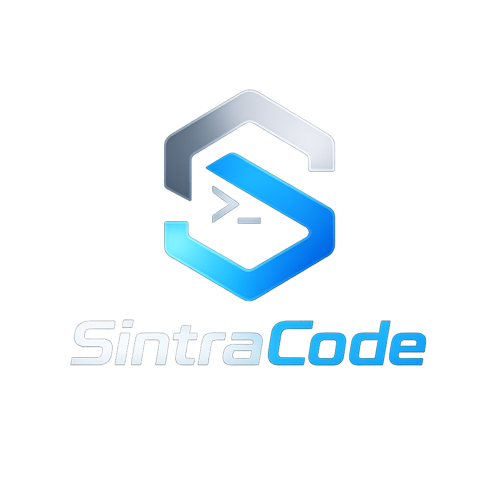

# Sintra



**Sintra** is a lightweight wrapper around the **Pi coding agent** (`@earendil-works/pi-coding-agent`). It provides a ready‑to‑use AI coding assistant with the familiar Pi terminal UI, but ships as a self‑contained project that can be dropped into any repository.

---

## Table of Contents

1. [What is Sintra?](#what-is-sintracode)
2. [Features](#features)
3. [Prerequisites](#prerequisites)
4. [Installation](#installation)
5. [Uninstallation](#uninstallation)
6. [Usage](#usage)
   - [Interactive mode](#interactive-mode)
   - [One‑shot / print mode](#print-mode)
   - [Running custom commands](#custom-commands)
7. [Configuration](#configuration)
8. [Adding Skills & Extensions](#adding-skills--extensions)
9. [Advantages & Disadvantages](#advantages--disadvantages)
10. [Troubleshooting](#troubleshooting)
11. [License & Credits](#license--credits)
12. [Contributing](#contributing)

---

## What is Sintra?

Sintra is essentially **Pi**, the minimal terminal‑based coding harness, bundled with a tiny wrapper script (`run-sintracode`) that:

- Prints a custom banner (`Welcome to Sintra`).
- Starts the Pi UI from the `sintracode/` directory (the Pi source code renamed to *sintracode*).
- Disables the default *context files* (`--no-context-files`) so that only the Pi UI / model output is shown, keeping the terminal clean.

All of the powerful Pi features—model selection, tools (read, bash, edit, write, etc.), extensions, skills, themes—are available unchanged.

---

## Features

| Feature | Description |
|---------|-------------|
| **Full Pi UI** | Header, message pane, editor, footer, keyboard shortcuts (`/quit`, `Ctrl+L` for model selector, etc.). |
| **One‑shot mode** | `-p/--print` flag for non‑interactive usage (useful in scripts/CI). |
| **Custom banner** | Simple, editable banner printed before Pi starts. |
| **Zero‑configuration start** | After `npm install` the wrapper works out‑of‑the‑box. |
| **Extensible** | Add **Skills** (`.pi/skills/`) and **Extensions** (`.pi/extensions/`) exactly as Pi expects. |
| **Model routing** | Choose any model supported by Pi (`openai/gpt‑4o`, `nvidia/nemotron‑3-ultra‑550b`, etc.). |
| **Cross‑platform** | Works on macOS, Linux, and (with minor tweaks) Windows (via WSL). |

---

## Prerequisites

- **Node.js** (v18 or later) – required to run Pi’s JavaScript code.
- **npm** (or `pnpm`/`yarn` – any that can install a `package.json`).
- **Python 3.11+** – only needed if you want to use Pi’s *Python* tools (`read`, `write`, etc.). The wrapper itself is pure Bash.
- **API keys** for the models you intend to use (OpenAI, Anthropic, NVIDIA NIM, etc.). See Pi’s docs for details.

---

## Installation

1. **Clone the repository** (or copy the folder into an existing project):
   ```bash
   git clone https://github.com/your‑org/sintracode.git
   cd sintracode
   ```

2. **Install the Pi dependencies** (the `sintracode/` directory already contains the full Pi source):
   ```bash
   npm install ./sintracode   # installs all of Pi’s node_modules
   ```

   This command creates `sintracode/node_modules/` with the required packages.

3. **Make the wrapper executable** (only needed once):
   ```bash
   chmod +x run-sintracode
   ```

4. **Optional – Add a convenient alias** to your shell (`~/.zshrc`, `~/.bashrc`, …):
   ```bash
   alias sintracode="$(pwd)/run-sintracode"
   source ~/.zshrc   # or the appropriate rc file
   ```
   Now you can start the agent with just `sintracode`.

---

## Uninstallation

To completely remove Sintra from your machine:

```bash
# Remove the whole project folder
cd ..
rm -rf sintracode

# (Optional) Remove the global Pi binary if you installed it previously
brew uninstall pi          # Homebrew
# or
npm uninstall -g @earendil-works/pi-coding-agent   # npm
```

If you added an alias to your shell, delete the line from your rc file and reload the shell.

---

## Usage

### Interactive mode (default)

```bash
./run-sintracode
```

You will see:
```
Welcome to Sintra
```
followed by the full Pi UI.  From there you can type prompts, use slash commands (`/quit`, `/model`, `/skill:name`, …), or run Bash commands by prefixing with `!`.

### Print mode (one‑shot)

For quick answers or CI pipelines:

```bash
./run-sintracode -p "Summarize the README.md"
```

The banner is printed, then the answer, and the process exits.

### Custom commands

You can pass any Pi flag after the wrapper, for example:

```bash
# Choose a specific model and a higher thinking level
./run-sintracode -p "Write a function to reverse a string" \
    --model openai/gpt-4o --thinking high
```

All Pi CLI options are supported because the wrapper forwards `$@` directly to `node sintracode/dist/cli.js`.

---

## Configuration

Sintra (the Pi wrapper) uses the same configuration system as the original Pi agent.  Settings can be placed at three levels:

1. **Global** – `~/.pi/agent/settings.json` (applies to every project on your machine).
2. **Project‑local** – `.pi/settings.json` inside the repository (overrides globals for that repo).
3. **Runtime overrides** – pass flags on the command line (e.g., `--model openai/gpt-4o`).

All of these files are **JSON** and follow Pi’s standard schema (see Pi’s `docs/settings.md` for the full schema).

### Persistent Memory Across Projects

Pi’s memory subsystem can store *learned patterns* that survive across sessions *and* across different projects.  The memory is kept under the **`.sintracode/`** directory at the repository root.  When you run `./run-sintracode` the wrapper automatically points Pi to this directory, enabling:

- **Global learnings** – once a pattern (e.g., “how to write a Dockerfile”) is observed, it is cached and can be reused in any future repository.
- **Project‑specific memories** – each project gets its own sub‑folder under `.sintracode/` (e.g., `.sintracode/learned_patterns/`).  These are merged with the global store when the model is queried.
- **Automatic pruning** – older low‑confidence entries are pruned automatically; you can also manually clear the memory with `/memory clear`.

#### Enabling / Disabling Memory

- By default memory is **enabled**.  To disable for a single run, add the flag `--no-memory` (if you add a custom flag to the wrapper) or set the environment variable `PI_MEMORY=0` before executing.
- To completely reset the global memory, delete the folder:

  ```bash
  rm -rf ~/.sintracode   # removes all global learned patterns
  ```

- To view the current memory contents, use the built‑in Pi command:

  ```bash
  /memory dump
  ```

#### Example: Learning a pattern

```bash
# First interaction – Pi discovers a new way to scaffold a Flask app
./run-sintracode -p "Scaffold a minimal Flask API with JWT auth"
# Pi generates the scaffold and records the steps in memory.

# Later, in a different repo, you ask for the same thing:
./run-sintracode -p "Create a Flask service that returns a JWT"
# Pi now retrieves the learned pattern and replies faster with a more concise answer.
```

The memory system is designed to be **transparent** – you don’t need to manually manage files; Pi handles storage, retrieval, confidence scoring, and decay automatically.

---

Pi looks for configuration in the usual places:

- Global: `~/.pi/agent/settings.json`
- Project‑local: `.pi/settings.json`

Create a `.pi` directory at the repository root if you want project‑specific settings:

```bash
mkdir -p .pi
cat > .pi/settings.json <<'JSON'
{
  "model": "openai/gpt-4o",
  "thinking": "high",
  "theme": "dark",
  "tools": ["read", "bash", "edit", "write"]
}
JSON
```

The wrapper already starts Pi with `--no-context-files` to keep the UI tidy, but you can remove that flag from `run-sintracode` if you ever need the default context file loading.

---

## Adding Skills & Extensions

### Skills

1. Create a directory under `.pi/skills/` (or any location you add via `--skill`).
2. Inside that directory add a `SKILL.md` file **following the Agent Skills specification** (name, description, optional assets, scripts, etc.).
3. Pi will automatically load the skill description into the system prompt. Access it with `/skill:<name>`.

Example:
```bash
mkdir -p .pi/skills/code‑review
cat > .pi/skills/code‑review/SKILL.md <<'MD'
---
name: code-review
description: Review code for bugs, security, and style.
---

# Code Review Skill

Run the linter and the static analyzer on the supplied files.
MD
```

### Extensions

Extensions are TypeScript (or JavaScript) modules that can add commands, tools, UI components, etc.

```bash
mkdir -p .pi/extensions/example
cat > .pi/extensions/example.ts <<'TS'
import { ExtensionAPI } from "@earendil-works/pi-coding-agent";

export default function (pi: ExtensionAPI) {
  pi.registerCommand("hello", {
    description: "Simple hello command",
    handler: async () => {
      pi.message("Hello from Sintra!");
    },
    expose: true,
  });
}
TS
```

Start Pi (or reload an existing session) and type `/hello`.

---

## Advantages of Using SintraCode with Built‑in Skills

One of the biggest strengths of **SintraCode** (the Pi‑based wrapper) is that it comes with a **catalog of pre‑installed, ready‑to‑use Skills** that map directly to common development domains.  These Skills are defined according to the **Agent Skills** specification and are automatically loaded into Pi’s system prompt, giving the model contextual knowledge about *when* and *how* to invoke each capability.

### What are built‑in Skills?

The repository ships with a collection of Skill directories under `./sintracode/.agents/skills/`.  Each Skill folder contains a `SKILL.md` file that describes:

- **Name** – the identifier you use with `/skill:<name>`.
- **Description** – a precise, human‑readable statement of the skill’s purpose.
- **Instructions / Usage** – optional scripts, examples, and reference material.

Because Pi loads **only the descriptions** into the system prompt (the full markdown files are loaded on‑demand), the model receives a concise, token‑efficient summary of every skill while still having access to the full implementation when needed.

### Built‑in Skill Catalog (as of today)

| Category | Skill (command) | What it does | Typical use‑case |
|----------|----------------|--------------|-------------------|
| **Backend** | `backend` | API design, database modeling, auth, caching, micro‑services. | Build a new FastAPI service or add OAuth2 to an existing Flask app. |
| **Cloud** | `cloud` | Provisioning, serverless, IAM, networking, cost‑optimisation. | Deploy a Lambda function, configure a GCP bucket, or audit AWS IAM policies. |
| **Code Review** | `code-review` | Automated static analysis, security scanning, style enforcement. | Run a quick review on a PR to catch obvious bugs before manual review. |
| **Content Creation** | `content-creator` | Draft blog posts, newsletters, marketing copy. | Generate a release‑notes draft from recent commit messages. |
| **Cracker** | `cracker` | Understand malicious techniques, obfuscation, packing. | Analyze a suspicious binary for known packing signatures. |
| **Cybersecurity** | `cybersecurity` | Secure coding guidance, encryption, OWASP, compliance. | Harden a Django app against XSS/CSRF. |
| **Data Science** | `data-science` | Data cleaning, modelling, Jupyter notebooks. | Load a CSV, perform a quick exploratory analysis, export a plot. |
| **Database** | `database` | Schema design, migrations, indexing, performance tuning. | Generate Alembic migrations for a new schema change. |
| **Debugging** | `debugging` | Reproduce bugs, isolate root cause, suggest fixes. | Walk through a stack trace and propose a patch. |
| **DevOps** | `devops` | CI/CD pipelines, Docker/K8s, Terraform, monitoring. | Create a GitHub Actions workflow for automated testing. |
| **Frontend** | `frontend` | UI/UX, React, Vue, accessibility, performance. | Scaffold a new component with Tailwind CSS and write tests. |
| **Game Development** | `game-dev` | Unity, Godot, shaders, physics, AI. | Generate a basic Unity C# script for player movement. |
| **Gym Coach** | `gym-coach` | Workout plans, activity tracking, motivation. | Build a weekly cardio schedule based on user goals. |
| **Mechanic** | `mechanic` | Automotive diagnostics, CAN‑bus, firmware updates. | Parse OBD‑II logs and propose a firmware flash sequence. |
| **MLOps** | `mlops` | Model training pipelines, experiment tracking, model serving. | Deploy a new version of a PyTorch model to a FastAPI endpoint. |
| **Mobile** | `mobile` | iOS/Android, React‑Native, Flutter, store submission. | Generate a Gradle build script for an Android library. |
| **Nurse** | `nurse` | Clinical documentation, medication workflows. | Create a shift‑handoff checklist for a ward. |
| **Pilot** | `pilot` | Flight‑data integration, cockpit UI, safety checks. | Simulate a flight‑plan validation routine. |
| **Rules** | `rules` | Skill governance, naming, yaml validation. | Validate a new skill’s front‑matter before committing. |
| **Scientist** | `scientist` | Research design, reproducibility, statistical analysis. | Draft a data‑collection protocol for a clinical trial. |
| **Testing** | `testing` | Unit, integration, E2E, coverage, CI integration. | Generate pytest fixtures for a new module and compute coverage. |

These Skills are **pre‑installed** – you do **not** need to create them yourself.  They will appear automatically in Pi’s **/skill** command list, and the model will reference them whenever a prompt matches the description.

### How built‑in Skills improve your workflow

1. **Instant expertise** – The model immediately knows *when* to call a backend‑design skill, a dev‑ops pipeline generator, or a security audit, without you having to write long prompts.
2. **Reduced token usage** – Only the short description is in the system prompt; the heavy‑weight documentation stays on‑disk and is fetched lazily.
3. **Consistent conventions** – Each Skill follows the Agent Skills spec (name, description, optional scripts).  Your projects stay aligned with a shared, versioned knowledge base.
4. **Easy extension** – If you need a custom workflow, simply add a new Skill directory under `.pi/skills/` and it becomes instantly available.
5. **Safety & governance** – Skills can declare required tools, prevent model‑only execution, and enforce policy (e.g., the `rules` skill validates new skill definitions before they are loaded).

### Example: Using a built‑in Skill in a single command

```bash
# Ask the agent to design a REST endpoint for user login using the backend skill.
./run-sintracode -p "Create a FastAPI POST /login that returns a JWT token" \
    --skill backend
```

The model sees the `backend` description, knows the task involves API design, and returns a ready‑to‑use FastAPI implementation, including error handling and token generation.

---

## Advantages & Disadvantages

| Advantage | Explanation |
|-----------|-------------|
| **Full Pi UI** | Header, message pane, editor, footer, keyboard shortcuts (`/quit`, `Ctrl+L` for model selector, etc.). |
| **One‑shot mode** | `-p/--print` flag for non‑interactive usage (useful in scripts/CI). |
| **Custom banner** | Simple, editable banner printed before Pi starts. |
| **Zero‑configuration start** | After `npm install` the wrapper works out‑of‑the‑box. |
| **Extensible** | Add **Skills** (`.pi/skills/`) and **Extensions** (`.pi/extensions/`) exactly as Pi expects. |
| **Model routing** | Choose any model supported by Pi (`openai/gpt‑4o`, `nvidia/nemotron‑3-ultra`, etc.). |
| **Cross‑platform** | Works on macOS, Linux, and (with minor tweaks) Windows (via WSL). |
| **Built‑in Skill catalog** | Ready‑made, token‑efficient skills for common domains (backend, devops, testing, etc.). |
| **Safety** | Skills can declare required tools or disable model‑only execution, reducing accidental misuse. |

| Disadvantage | Explanation |
|-------------|-------------|
| **Depends on Node.js** | If a project already uses another runtime, you still need Node for Pi. |
| **No original SintraCode autonomous suite** | This wrapper only provides the Pi UI; the previous 24‑agent autonomous workflow is not included. |
| **Performance tied to chosen model** | Poor model choice can affect speed/quality; you must manage API keys and rate limits. |
| **Limited to Pi’s toolset** | While extensible, you are confined to the tools Pi defines (`read`, `bash`, `edit`, `write`). |
| **Requires API keys** | You must obtain and configure keys for the provider(s) you want to use. |

---

## Troubleshooting

| Symptom | Likely cause | Fix |
|---------|--------------|-----|
| `Module not found` errors | Missing `node_modules` | Re‑run `npm install ./sintracode` |
| No model response | No API key set or wrong provider | Export the proper env var, e.g. `export OPENAI_API_KEY=sk‑…` |
| "Command not found: pi" | Global Pi not installed (if you rely on a system‑wide `pi` command) | Use the wrapper (`./run-sintracode`) or install Pi globally (`npm i -g @earendil-works/pi-coding-agent`). |
| Banner not showing | Wrapper script not executable | `chmod +x run-sintracode` |
| Unexpected skill listed | Old skill files left in the repo | Delete or move them, then run `pi /reload`. |

---

## License & Credits

The code in `sintracode/` is **the original Pi coding agent**, which is released under the **MIT License** (see `sintracode/LICENSE` inside the copied directory).

The wrapper script (`run-sintracode`) and this documentation are authored by you and are also offered under the MIT License.

---

## Contributing

Contributions are welcome! Feel free to:

1. Fork the repository.
2. Add new **Skills**, **Extensions**, or UI tweaks.
3. Submit a Pull Request with a clear description of the change.
4. Ensure that `npm test` (if you add tests) passes before opening the PR.

---

## Contact

For questions or ideas, open an issue on the repository or join the Pi community on Discord: https://discord.com/invite/3cU7Bz4UPx

---

*Happy coding with Sintra!*

### Advantages

- **Zero‑setup start** – After a single `npm install` you have a fully functional AI coding assistant.
- **Full Pi feature set** – Model selection, tools, extensions, skills, themes, session tree, compaction, etc.
- **Portable** – Everything lives inside the repository; no global state required (unless you install Pi globally).
- **Customizable banner** – Simple Bash script makes it easy to brand the tool.
- **Works with existing Pi workflows** – You can still use `pi` commands, session files, and the Pi SDK.

### Disadvantages

- **Depends on Node.js** – If a project already uses another language for its tooling, you need Node installed.
- **No original SintraCode features** – The previous autonomous 24‑agent suite is not included; this is a *wrapper* around the generic Pi agent.
- **Performance limited by the chosen model** – The experience is tied to the model you configure (e.g., OpenAI, NVIDIA NIM). Poor model choice can affect speed/quality.
- **Limited to Pi’s toolset** – While extensible, you are constrained to what Pi’s tool system supports (`read`, `bash`, `edit`, `write`).
- **Requires API keys** – You must obtain and configure keys for the provider(s) you plan to use.

---

## Troubleshooting

| Symptom | Likely cause | Fix |
|---------|--------------|-----|
| `Module not found` errors | Missing `node_modules` | Re‑run `npm install ./sintracode` |
| No model response | No API key set or wrong provider | Export the proper env var, e.g. `export OPENAI_API_KEY=sk‑…` |
| “Command not found: pi” | Global Pi not installed (if you rely on a system‑wide `pi` command) | Use the wrapper (`./run-sintracode`) or install Pi globally (`npm i -g @earendil-works/pi-coding-agent`). |
| Banner not showing | Wrapper script not executable | `chmod +x run-sintracode` |

---

## License & Credits

The code in `sintracode/` is **the original Pi coding agent**, which is released under the **MIT License** (see `sintracode/LICENSE` inside the copied directory).

The wrapper script (`run-sintracode`) and this documentation are authored by you and are also offered under the MIT License.

---

## Contributing

Contributions are welcome! Feel free to:

1. Fork the repository.
2. Add new **Skills**, **Extensions**, or UI tweaks.
3. Submit a Pull Request with a clear description of the change.
4. Ensure that `npm test` (if you add tests) passes before opening the PR.

---

## Contact

For questions or ideas, open an issue on the repository or join the Pi community on Discord: https://discord.com/invite/3cU7Bz4UPx

---

*Happy coding with Sintra!*